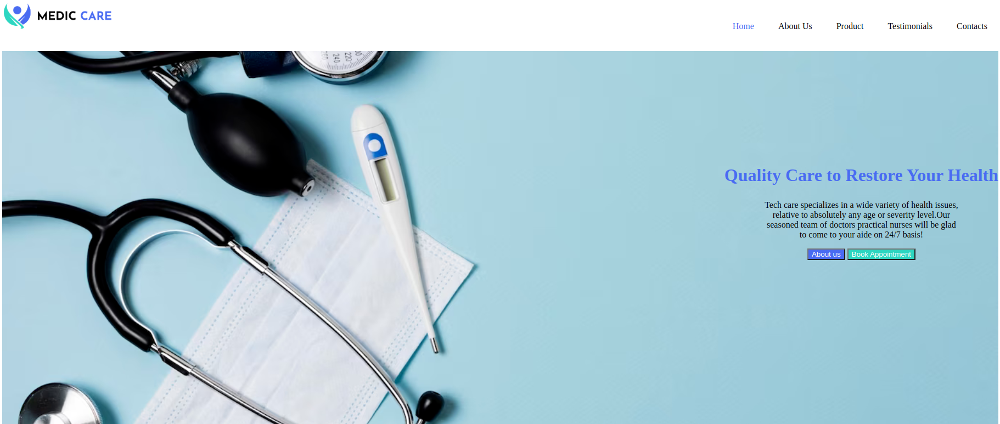

# Medic-care project
___
## Project Desciption ##
___
Medic-care is a website for a innovative medical company where clients can visit and learn more about the treatments offered and the services given by the company.
___
## Live link ##
To access the project live use this link [link]( https://keziahnasir.github.io/Medic-care/)
## Screenshots ##
___
This is a sample of my project

___
## Technologies used ##
* html 
* css 
___
## project setup and installation ##
1. open the terminal and navigate to where you want to store the project.eg `cd Desktop`
___
2. To clone the github project paste this on the terminal`git clone https://github.com/KeziahNasir/Medic-care.git`
___
3.   use cd medical to get into medic-care directory.
___
4. open the project with your favorite web browser.
___
## Contacts ##
If you like to get in touch with me for more information,collaborations or feedback one can use this email nasirkeziah256@gmail.com
___
## License ##
MIT License

Copyright (c) [2024] [keziah nasir]

Permission is hereby granted, free of charge, to any person obtaining a copy
of this software and associated documentation files (the "Software"), to deal
in the Software without restriction, including without limitation the rights
to use, copy, modify, merge, publish, distribute, sublicense, and/or sell
copies of the Software, and to permit persons to whom the Software is
furnished to do so, subject to the following conditions:

The above copyright notice and this permission notice shall be included in all
copies or substantial portions of the Software.

THE SOFTWARE IS PROVIDED "AS IS", WITHOUT WARRANTY OF ANY KIND, EXPRESS OR
IMPLIED, INCLUDING BUT NOT LIMITED TO THE WARRANTIES OF MERCHANTABILITY,
FITNESS FOR A PARTICULAR PURPOSE AND NONINFRINGEMENT. IN NO EVENT SHALL THE
AUTHORS OR COPYRIGHT HOLDERS BE LIABLE FOR ANY CLAIM, DAMAGES OR OTHER
LIABILITY, WHETHER IN AN ACTION OF CONTRACT, TORT OR OTHERWISE, ARISING FROM,
OUT OF OR IN CONNECTION WITH THE SOFTWARE OR THE USE OR OTHER DEALINGS IN THE
SOFTWARE.